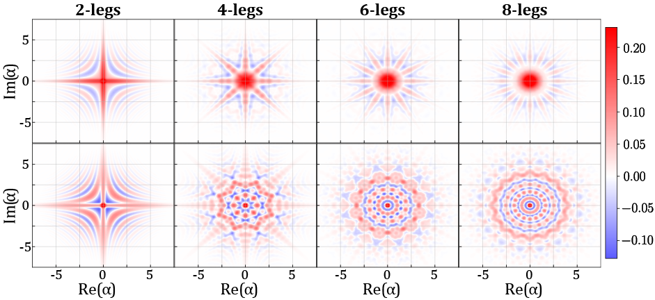
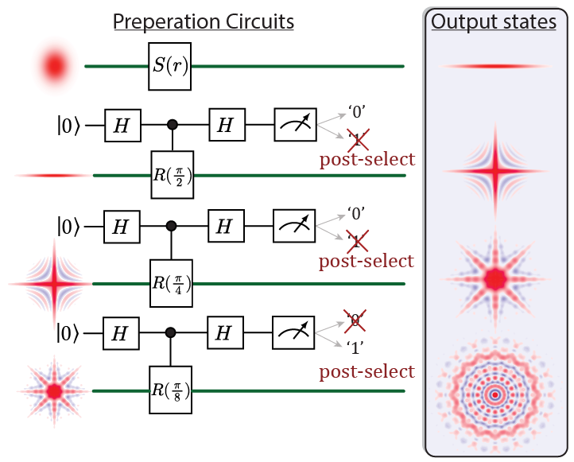
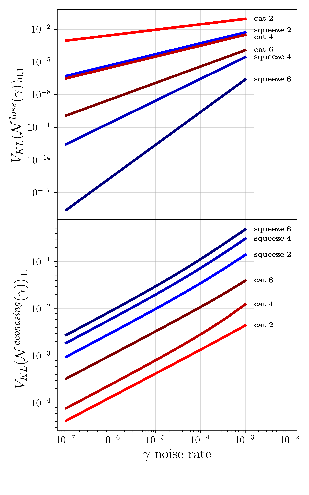
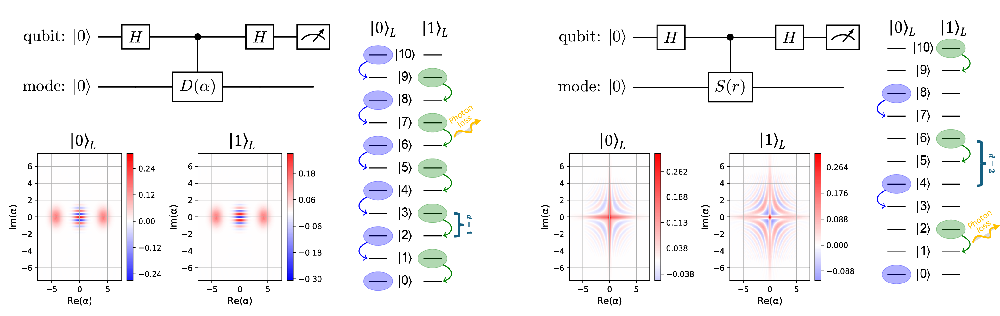

# Squeezed Vacuum Quantum Error Correction Codes

Python tools for simulating multi-legged squeezed vacuum bosonic quantum error correction codes. 
Includes probabilistic and deterministic preparation protocols, Kraus operator analysis, and numerical validation of quantum error correction conditions.


## Overview

This codebase accompanies research on bosonic quantum error correction codes constructed from superpositions of squeezed vacuum states in multiple directions. The codes can protect quantum information encoded in continuous-variable (CV) systems against photon loss and dephasing errors.


### Key Features

- **Multi-legged code generation**: Create m-legged bosonic codes (cat codes and squeezed vacuum codes) with arbitrary number of legs
<p align="center">
  
</p>
- **Preparation protocols**: 
  - Probabilistic preparation via post-selection on ancilla qubits
  - Deterministic preparation using controlled squeezing and feed-forward
  - Measurement-free protocols using controlled rotations
<p align="center">
  
</p>
- **Error analysis**: 
  - Kraus operator formalism for photon loss and dephasing channels
    - Numerical verification of Knill-Laflamme quantum error correction conditions
    - Cost function computation for comparing code performance
<p align="center">
  
</p>
- **Logical operations**: Testing logical X, Z gates and state rotations
- **Analytical expressions**: Symbolic computation of code properties using SymPy
- **Visualization**: Wigner function plots, Fock distributions, and phase-space representations

## Physics Background

### Squeezed Vacuum States


The codes are built from squeezed vacuum states of the form:
```
|S(r,θ)⟩ = S(r,θ)|0⟩
```
where `S(r,θ) = exp[r(e^{2iθ}a² - e^{-2iθ}a†²)/2]` is the squeezing operator, `r` is the squeezing strength, and `θ` is the squeezing direction in phase space.


### Multi-legged Codes

An m-legged squeezed code encodes logical states as:
```
|0_L⟩ ∝ Σⱼ |S(r, 2πj/m)⟩
|1_L⟩ ∝ Σⱼ e^{i2πj/m} |S(r, 2πj/m)⟩
```

These codes can detect and correct specific errors while using only single-mode bosonic states.

### Error Correction

The codes satisfy the Knill-Laflamme conditions:
```
⟨ψₖ|E†ᵢEⱼ|ψₗ⟩ = δₖₗ cᵢⱼ
```
for photon loss (`Eⱼ = √(γʲ/j!) (1-γ)^{n/2} aʲ`) and dephasing (`Eⱼ = √(γʲ/j!) exp(-γn²/2) nʲ`) channels.


<p align="center">
  
</p>


## Repository Structure

```
squeezed-vacuum-codes/
├── src/
│   ├── squeezing_code.py           # Main SqueezingCode class
│   ├── codes_built_in_superposition.py  # m-legged code generators
│   ├── preparation_circuits.py     # Probabilistic preparation
│   ├── deterministic_preparation.py # Deterministic protocols
│   ├── kraus_maps.py               # Kraus operators for noise channels
│   ├── cost_functions.py           # Performance metrics (KL divergence, fidelity)
│   ├── mean_photon_number.py       # Resource analysis
│   ├── analytical_expressions.py   # Symbolic derivations
│   ├── noise.py                    # Noise simulation via Lindbladian evolution
│   ├── measurements.py             # Qubit measurement and post-selection
│   ├── visualizations.py           # Wigner functions and plotting
│   ├── bosonic_operators.py        # Ladder operators and utilities
│   └── quantum/                    # Quantum mechanics utilities
│       ├── density_matrices/
│       ├── metrics/
│       └── visualizations/
├── scripts/
│   ├── prove_QECC.py              # Verify error correction conditions
│   ├── probability_of_preparation.py # Success probability analysis
│   ├── study_measurement_free_code.py # Deterministic protocols
│   ├── plot_code_states.py        # Visualization scripts
│   ├── logical_x_test.py          # Logical operator verification
│   └── graphs_for_paper/          # Publication figures
│       ├── code_family.py
│       └── numerics1.py
├── tests/                          # Unit tests
├── globals.py                      # Configuration flags
└── requirements.txt
```

## Installation

### Prerequisites
- Python 3.11.9 (recommended)
- Virtual environment (recommended)

### Setup

```bash
# Clone the repository
git clone https://github.com/AdQuanta-Quantum-Information/squeezed-vacuum-codes.git
cd squeezed-vacuum-codes

# Create and activate virtual environment
python -m venv .venv

# Windows
.venv\Scripts\activate

# macOS / Linux
source .venv/bin/activate

# Upgrade pip and install dependencies
python -m pip install --upgrade pip
pip install -r requirements.txt
```

### Dependencies

Core packages:
- **qutip** (5.2.2): Quantum mechanics simulation
- **numpy** (2.3.4): Numerical computations
- **scipy** (1.16.3): Scientific computing
- **sympy** (1.14.0): Symbolic mathematics
- **matplotlib** (3.10.7): Visualization
- **mpmath** (1.3.0): High-precision arithmetic for Kraus operators
- **joblib** (1.5.2): Caching and parallelization

## Key Scripts


- **`scripts/probability_of_preparation.py`**: Analyzes success probability of probabilistic preparation as a function of squeezing strength. Compares analytical expressions with numerical simulations.

- **`scripts/prove_QECC.py`**: Systematically verifies that the codes satisfy quantum error correction conditions. Implements the 8-step verification process from theory.

- **`scripts/study_measurement_free_code.py`**: Explores deterministic preparation using conditional rotations without ancilla measurement.

- **`scripts/deterministic_preparation.py`**: Implements feed-forward protocols for deterministic code preparation.

- **`scripts/logical_x_test.py`**: Tests logical X operator implementation and validates state transitions.

- **`scripts/graphs_for_paper/code_family.py`**: Generates performance comparison plots for codes with different numbers of legs.

- **`scripts/graphs_for_paper/numerics1.py`**: Produces numerical analysis figures for publication.

## Configuration

Edit `globals.py` to control:

```python
PRECISE = True          # Use high-precision arithmetic (mpmath)
DEBUG = True            # Enable assertion checks
CACHE_ON_DISK = True    # Cache expensive computations
LaTeX_RENDERING = True  # Use LaTeX in plots
```

## Caching

The code uses `joblib` for caching expensive computations. Cache directories:
- **RAM cache**: Temporary, cleared on exit
- **Disk cache**: `joblib_cache/` (persistent across runs)

Clear cache if you modify core functions:
```bash
rm -rf joblib_cache/
```


## Mathematical Notation
Commonly used variables throughout the code (and the paper):

- `r`: Squeezing strength (unitless)
- `θ`: Squeezing direction angle
- `m`: Number of legs in code
- `γ`: Noise strength parameter
- `α`: Displacement amplitude (for cat codes)
- `|0_L⟩, |1_L⟩`: Logical codewords
- `a, a†`: Bosonic ladder operators
- `n̂ = a†a`: Number operator

## Citation

If you use this code in your research, please cite:

```bibtex
@misc{squeezed-vacuum-codes,
  author = {AdQuanta - Quantum Information},
  title = {Squeezed Vacuum Quantum Error Correction Codes},
  year = {2025},
  publisher = {GitHub},
  url = {https://github.com/AdQuanta-Quantum-Information/squeezed-vacuum-codes}
}
```


## Contributing

Contributions are welcome! Please:
1. Fork the repository
2. Create a feature branch
3. Add tests for new functionality
4. Submit a pull request

## License
MIT License - see [LICENSE](LICENSE) file for details.


## Contact
For questions or collaboration inquiries, you can open an issue on GitHub or reach via email to [nirgutman212@campus.technion.ac.il](mailto:nirgutman212@campus.technion.ac.il).

## Acknowledgments

This work uses the QuTiP (Quantum Toolbox in Python) library for quantum mechanics simulations.
